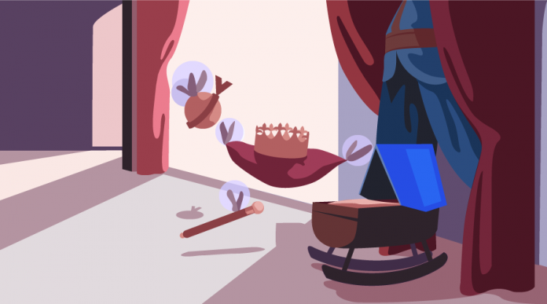
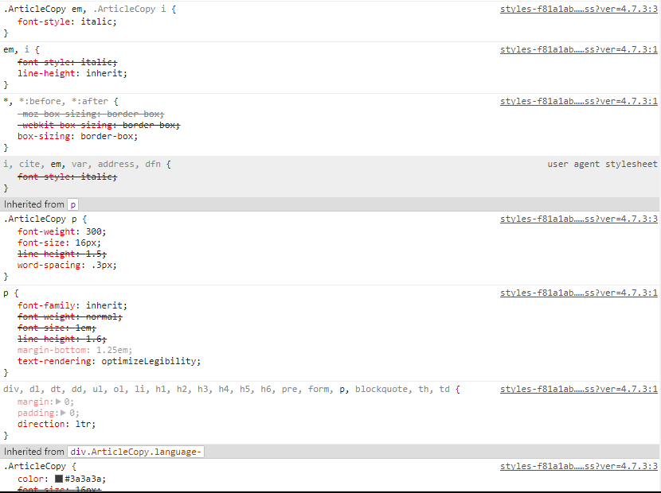

# 【译】CSS继承：介绍



在现实生活中看到继承行为是常见的。除非有其他因素发挥作用，否则高大的父母常常会有高大的孩子等等。我们可以在CSS中看到类似的东西。

 如果将容器元素的颜色设置为绿色，则容器中所有元素的颜色将为绿色，除非某些规则覆盖该颜色值。将某些属性的值从父元素传递给子元素的机制称为继承。

在本文中，你将了解继承的各个方面以及它是如何影响不同元素的外观的。

## CSS继承的作用？

CSS继承大大减少了创建网站所需的时间和精力。想象一下，你需要写多少CSS来设置`body`标签的所有子元素的颜色。这将是耗时的、易错的以及难以维护的。同样，你可以想像如果你被迫在容器的每个子元素上设置`font-family`或`font-size`，那将是一场噩梦。

看下面的示例：

<iframe id="cp_embed_VzeXzM" class="cp_embed_iframe " title="CSS Inheritance example" src="https://codepen.io/SitePoint/embed/VzeXzM?height=569&amp;theme-id=6441&amp;slug-hash=VzeXzM&amp;default-tab=result&amp;user=SitePoint&amp;embed-version=2&amp;pen-title=CSS%20Inheritance%20example" name="CodePen Embed" width="100%" height="569" frameborder="0" scrolling="no" allowfullscreen="allowfullscreen" data-mce-fragment="1"></iframe>

这里我已经在`body`元素中定义了`font-family`、`font-size`和`line-height`属性，但所有这些值都是由嵌套在`body`中的不同元素继承而来的。
这使得布局的统一性不需要在多个元素上重复相同的属性。

## 只有某些属性被继承

在现实生活中，不是父母的全部特征都会传给子女。在CSS中也是如此，不是每个CSS属性都默认由子元素继承。实际上，如果所有的属性都是继承的，那么这个效果就好比没有继承，你必须编写大量的CSS来覆盖这些行为。

例如，如果`border`属性是可继承的，则在单个元素上设置边框将导致在其所有子元素上显示相同的边框。同样，如果子元素从他们的父元素继承了`background-image`属性，结果就会变得混乱。以下CodePen示例演示了如何使用CSS关键字值来查看这种情况，我将在下一节中讨论：

<iframe id="cp_embed_XaXEzd" class="cp_embed_iframe " title="How Borders Would Work if they Inherited by Default" src="https://codepen.io/SitePoint/embed/XaXEzd?height=707&amp;theme-id=6441&amp;slug-hash=XaXEzd&amp;default-tab=result&amp;user=SitePoint&amp;embed-version=2&amp;pen-title=How%20Borders%20Would%20Work%20if%20they%20Inherited%20by%20Default" name="CodePen Embed" width="100%" height="707" frameborder="0" scrolling="no" allowfullscreen="allowfullscreen" data-mce-fragment="1"></iframe>

## 强制继承

一般来说，是否使属性可继承属于常识。例如，除了上一节中讨论的示例之外，你可能不希望元素的所有子元素都继承其父元素的padding值。但是，如果文本的颜色或用于容器的不同子元素的字体相同，那么你通常会更喜欢。

在某些情况下，特殊的属性可能不会继承，但你可能仍希望从父元素继承。这可以通过将子元素的该属性值设置为`inherit`来实现：

```css
.some-child {
  color: inherit;
}
```

假设你想要将网站上所有链接元素的颜色与其父元素上定义的颜色相同。有几种方法可以做到这一点。例如，你可以使用不同的类用于具有不同颜色的链接和容器元素。但是，最简单的方法之一是使用`inherit`关键字。

一旦链接元素的颜色属性设置为`inherit`，它们将开始继承父元素的颜色：

```css
p {
  color: #f44336;
}

ul {
  color: #3f51B5;
}

a {
  color: inherit;
}
```

示例：

<iframe id="cp_embed_qXbopm" class="cp_embed_iframe " title="Using the `inherit` keyword to force inheritance" src="https://codepen.io/SitePoint/embed/qXbopm?height=580&amp;theme-id=6441&amp;slug-hash=qXbopm&amp;default-tab=result&amp;user=SitePoint&amp;embed-version=2&amp;pen-title=Using%20the%20%60inherit%60%20keyword%20to%20force%20inheritance" name="CodePen Embed" width="100%" height="580" frameborder="0" scrolling="no" allowfullscreen="allowfullscreen" data-mce-fragment="1"></iframe>

## 使用CSS简写的继承

`inherit`关键字的一个特性是当你将其应用于简写属性时，它将应用于所有子属性，甚至起初你可能没有实现的那些属性也被强制继承。另外，使用简写时，你也不能指定其中单个子属性继承值。 

例如，你可能希望以下CSS应用1px宽度的实线边框，其颜色从父元素继承。然而，声明实际上是无效的：

```css
.example {
  /* 无效 CSS */
  border: 1px solid inherit;
}
```

类似地，你不能使用简写属性将margin或padding的一边设置为特定值，另一边设置为继承值。这将再一次使声明无效：

```css
.example {
  /* 无效 CSS */
  margin: 10px inherit 20px 15px;
}
```

这个问题的解决方案是，将想要继承的属性值设置任意值，然后将它相对应的普通属性（非简写）值设为`inherit`：

```css
.example {
  margin : 10px 0 20px 15px;
  margin-right: inherit;
}
```

### 缺省简写值

当简写时，其值尚未明确提供的任何缺省子属性将被设置为其初始值（或默认值）。思考下面的CSS：

```css
.container-a {
  font: italic 1.2em/1.75 Lato;
}

.container-a p {
  font: bold 1em Lato;
}
```

在这里，段落文本将不会从其容器继承`font-style`的值。 `font-style`值实际上将被重设为初始值`normal`。因此，在这种情况下，如果你想要继承父母`font`的简写，同时仍然确保该段保持粗体，则必须使用普通写法的`font-weight`属性。

<iframe id="cp_embed_qXbooj" class="cp_embed_iframe " title="CSS Inheritance and Shorthand" src="https://codepen.io/SitePoint/embed/qXbooj?height=340&amp;theme-id=6441&amp;slug-hash=qXbooj&amp;default-tab=result&amp;user=SitePoint&amp;embed-version=2&amp;pen-title=CSS%20Inheritance%20and%20Shorthand" name="CodePen Embed" width="100%" height="340" frameborder="0" scrolling="no" allowfullscreen="allowfullscreen" data-mce-fragment="1"></iframe>

## 使用DevTools查看继承值

可以使用DevTools来查看元素从其父元素或DOM树中的另一个元素继承的属性。
如前所述，并不是父元素的所有属性都是可继承的。所有可继承的属性也不会将其转到继承链的末尾，而不会被别的其他CSS规则覆盖。 

DevTools为你提供不同的视觉提示，以便轻松区分所有这些属性，你可以从下面的截图中看到，截取自SitePoint的CSS：



所选元素不可继承的任何属性都会变暗。可继承但被覆盖的属性将以删除线文本显示。

## 可继承的CSS属性列表

似乎没有一个唯一明确的来源列出所有可继承的CSS属性，但下面可能是一个正确的列表，基于几个来源：

* border-collapse
* border-spacing
* caption-side
* color
* cursor
* direction
* empty-cells
* font-family
* font-size
* font-style
* font-variant
* font-weight
* font-size-adjust
* font-stretch
* font
* letter-spacing
* line-height
* list-style-image
* list-style-position
* list-style-type
* list-style
* orphans
* quotes
* tab-size
* text-align
* text-align-last
* text-decoration-color
* text-indent
* text-justify
* text-shadow
* text-transform
* visibility
* white-space
* widows
* word-break
* word-spacing
* word-wrap

还有一些[与语音相关的CSS属性](https://www.w3.org/TR/css3-speech/)是可继承的，但不包括在上面的列表中。

以下是可继承属性列表的几个来源：

* [CSS2.2全属性表](https://www.w3.org/TR/CSS22/propidx.html) 
* [哪些CSS属性是继承的？](https://stackoverflow.com/questions/5612302/which-css-properties-are-inherited)（堆栈溢出问题）

你还可以在规范中或任何全面的CSS引用中查看单个CSS属性的信息，通常会告诉你该属性是否在默认情况下可继承。

## 总结

总结一下我讨论过的内容：继承可以避免编写重复的CSS规则，以将同一组属性应用于元素的所有后代。它大大简化了向网页添加样式的过程，因此是CSS的一个很好的特性。

CSS还允许你使用`inherit`关键字强制对未在默认情况下继承的属性继承。 DevTools可以让你轻松访问元素从其祖先继承的所有属性。这可以帮助你快速找出常见布局相关问题的解决方案。

**推荐阅读**

**[Build Responsive Real World Websites with HTML5 and CSS3](https://goo.gl/J3F8zg)**

**[HTML & CSS: 200+ Most Important Q&A for Interviews & Exams.](https://wp.me/p8WL1y-OH)**

**[Step By Step HTML and CSS course for beginners](http://edusavecoupon.net/?p=19166)**

**[Bootstrap 4 From Scratch With 5 Projects](https://wp.me/p8iOGF-18U)**


原文来源：[https://www.sitepoint.com/css-inheritance-introduction/](https://www.sitepoint.com/css-inheritance-introduction/)


* *本文章翻译自[CSS Inheritance: An Introduction](https://dev.codetrick.net/css-inheritance-introduction/)。*
* *本人英文水平有限，翻译不正确不通顺的地方，敬请指出。*
