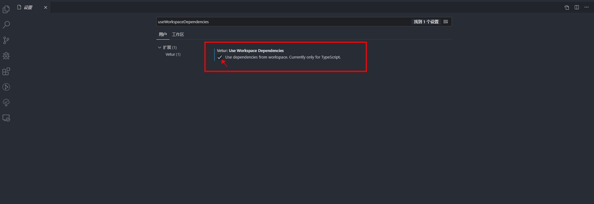

上周微软 TypeScript 程序经理 Daniel
Rosenwasser（[@drosenwasser](https://twitter.com/drosenwasser)）
发[推文](https://twitter.com/drosenwasser/status/1202310742436761600)：Optional
Chaning 特性进入 TC39 的第 4 阶段，`?.`运算符现在是 ES2020 标准的一部分了。


一个月前 TypeScript 发布
了[ 3.7 新版本](https://devblogs.microsoft.com/typescript/announcing-typescript-3-7/)，
在 3.7 版本中就有两个新特性 Optional Chaining 和 Nullish Coalescing 。网络上有很
多猿媛询问这两个特性有什么作用以及在编辑器 VS Code 中怎么使用。今天就以我在 VS
Code 中开发 Vue 项目实践经验来聊聊这两个特性。

我们可以通过 Babel 或 TypeScript 工具在新项目中使用这两个特性，但是目前尽量不要
在长期维护的重要项目中使用，以避免这两个特性无法入选正式标准而造成损失。当前
Chrome 80+版本（开发者版本）浏览器已支持这两个运算符。

## Optional Chaining（安全导航运算符）

在 JS 中当访问一个树状结构对象的深层属性时，如果中间某一个属性值
为`null`或`undefined`时，运行就会报错。同样，后端服务 API 在很多情况下返回的数据
也可能为`null`或`undefined`，如果不做判断，很容易报错。之前我们通常会使用`&&`进
行判断，以确保不会出错。现在我们可以直接使用安全导航符`?.`来访问：

```js
// 之前
let d;
if (a && a.b && a.b.c) {
  d = a.b.c;
}
// 现在
d = a?.b?.c;
```

**注意：`?.`与`&&`有所不同，`&&`对假值（例如：空字符串、`0`、`NaN`以及`false`等
）起作用，但是`?.`并不会对假值起作用。**

使用`?.`访问属性时，遇到当前属性值为`null`或`undefined`时，会立即停止继续当前操
作，并且返回`undefined`。

```js
// 输入
a?.b.c();

// 输出
var _a;
(_a = a) === null || _a === void 0 ? void 0 : _a.b.c();
```

**注意：安全导航符仅仅判断当前属性值（`?.`左侧的属性值）是否
为`null`或`undefined`，而不会检查后面（`?.`右侧的属性值）的任何属性**

对于上面的示例，如果`b`为`null`或`undefined`时，执行`a?.b.c()`也会报错，同理如
果`c`为`null`或`undefined`时，执行`a?.b.c()`同样会报错。

通过上面的介绍，我们得知安全导航符`?.`是一个语法糖，可以减少平时编写代码时为了确
保正确而过多重复判断代码的问题。安全导航
符`?.`在`C#`、`Swift`、`Kotlin`和`Ruby`等语言中都要实现，但各个之间都略有差异，
这里我们只关注 JavaScript 中的安全导航符`?.`，下面我们来深入了解一下。

### 语法：

```js
 obj?.prop         \\ 可选判断静态属性访问
 obj?.[expr]       \\ 可选判断动态属性访问
 func?.(...args)   \\ 可选判断函数或方法调用
```

用法其实就是将我们熟悉的`.`运算符替换为`?.`运算符，注意看是不是觉得`?.`运算符和
三目运算符`? :`略像但又不像，

### 特性：

> -
>
> - https://github.com/tc39/proposal-optional-chaining
> - http://www.typescriptlang.org/docs/handbook/release-notes/typescript-3-7.html#optional-chaining

## Nullish Coalescing

> -
>
> - https://github.com/tc39/proposal-nullish-coalescing
> - http://www.typescriptlang.org/docs/handbook/release-notes/typescript-3-7.html#nullish-coalescing

## 在 VS Code 开发 Vue 时怎么使用 Optional Chaining 和 Nullish Coalescing

### 配置 VS Code 支持新特性语法

[VS Code](https://code.visualstudio.com/)是近些年由微软出品非常受欢迎的编辑器，
VS Code 对于 Web 前端开发非常友好，提供了大量的自动化操作。尤其是对 JavaScript
提供了智能的代码提示，代码自动完成，语法错误提示等特性。这些特性是基于
TypeScript 语言服务提供的，也就是如果想要在 VS Code 使用 JS 新特性必须获得
TypeScript 语言服务支持，否则 VS Code 会提示语法错误。

VS Code 每次发布新版本都会携带相对应的最新版本 TypeScript，以便猿媛们能开开心心
地使用新特性。但猿媛们经常喜欢喜欢尝鲜，比如在 TypeScript 3.7 RC 发布时，就想在
VS Code 1.39 版本（VS Code 1.40 中才内置 TypeScript 3.7）中使用新特性，直接在 VS
Code 中使用就会提示语法错误，那怎么办呢？


在`.js`或`.ts`文件中使用新特性：

1. 安装 VS Code 官方提供的扩展程
   序[JavaScript and TypeScript Nightly](https://marketplace.visualstudio.com/items?itemName=ms-vscode.vscode-typescript-next)

   - 此扩展程序为每日构建版支持最新的实验特性
   - 使用此扩展程序 VS Code 版本必须在 1.36 及以上

   

2. 在 VS Code 中打开`.js`或`.ts`文件

3. 使用快捷键`Ctrl`+`Shift`+`P`打开命令框，输
   入`TypeScript: Select TypeScript version`命令
   
4. 如果有多个 TypeScript 版本可选，选择【使用 VS Code 的版本（Use VS Code's
   version selected）】
   

按以上步骤操作完成后，就可以在`.js`或`.ts`文件中使用新特性，VS Code 便不会提示语
法报错，但是如果我们在`.vue`文件中使用新特性还会报错，下面我们就来处理这个问题。


### 配置`.vue`文件支持新特性语法

`.vue`文件中的语言服务是由 VS Code 扩展程
序[Vetur](https://marketplace.visualstudio.com/items?itemName=octref.vetur)提供
的， Vetur 基于 vue 语言服务，而 Vue 语言服务又基于 Typescript 语言服务。 Vetur
扩展程序中依赖的 TypeScript 版本并不是实时跟随 TypeScript 更新，导致 Vetur 扩展
程序不能及时支持 TypeScript 提供的新特性，比如 TypeScript 3.7 已经发布半个多月了
， Vetur 扩展程序还是无法支持 Optional Chaining 和 Nullish Coalescing 这两个新特
性。那怎么办呢？


- 首先必须在 VS Code 中安装 Vetur 扩展程
  序
- 在当前项目中使用`npm`或`yarn`安装
  TypeScript，`npm i --save-dev typescript`或`yarn add typescript --dev`
  > 可以通过`npm view typescript`或`npm info typescript`命令查看 Typescript 的版
  > 本信息
  > 。
- 打开 VS Code 的设置界面，在搜索框输入`useWorkspaceDependencies`进行搜索，勾选
  Use Workspace
  Dependencies
- 重启 VS Code 后设置成
  功

### 使用 Babel 编译

目前我们开发 Vue 相关项目一般都使用[Babel](https://babeljs.io/)作为编译工具，以
便能提供更好的兼容性。如果没有 babel 工具编译直接使用 Optional Chaining 和
Nullish Coalescing 这两个特性，在浏览器中运行就会报错，毕竟浏览器对于 ECMAScript
标准的最新特性及实验性特性不会马上支持。

Babel 很早就提供了针
对[Optional Chaining](https://babeljs.io/docs/en/next/babel-plugin-proposal-optional-chaining.html)
和
[Nullish Coalescing](https://babeljs.io/docs/en/babel-plugin-proposal-nullish-coalescing-operator)这
两个特性的插件。以下配置针对 Vue 项目和 Babel 7 及以上版本：

- 使用`npm`或`yarn`安
  装`@babel/plugin-proposal-optional-chaining`和`@babel/plugin-proposal-nullish-coalescing-operator`开
  发依赖
  ```shell
  npm install --save-dev @babel/plugin-proposal-optional-chaining
  # 或
  yarn add @babel/plugin-proposal-optional-chaining --dev
  ```
  ```shell
  npm install --save-dev @babel/plugin-proposal-nullish-coalescing-operator
  # 或
  yarn add @babel/plugin-proposal-nullish-coalescing-operator --dev
  ```
- 在`.babelrc`文件或`babel.config.js`文件或`package.json`中（根据自己选择）配置
  Babel 插件
  ```js
  // 在babel.config.js中的配置示例
  module.exports = {
    presets: ['@vue/app'],
    plugins: [
      '@babel/plugin-proposal-optional-chaining',
      '@babel/plugin-proposal-nullish-coalescing-operator',
    ],
  };
  ```
- 插件参数`loose`，类型为`boolean`，默认值为`false`。当值为`true`时，会使用等
  于`null`而非使用严格全等的`null`和`undefined`做检查，具体看下面示例：

  ```js
  // 输入
  foo?.bar;

  // 输出 当loose === true时
  foo == null ? void 0 : foo.bar;

  // 输出 当loose === false时
  foo === null || foo === void 0 ? void 0 : foo.bar;
  ```

  ```js
  // 输入
  var foo = object.foo ?? 'default';

  // 输出 当loose === true时
  var _object$foo;
  var foo = (_object$foo = object.foo) != null ? _object$foo : 'default';

  // 输出 当loose === false时
  var _object$foo;
  var foo =
    (_object$foo = object.foo) !== null && _object$foo !== void 0
      ? _object$foo
      : 'default';
  ```

  > 这两个操作符的判断都涉及到了`document.all`，现代浏览器的行
  > 为`document.all == null`返回`true`，是的你没有看错确实返回了`true`。之所以出
  > 现这样的行为，是因为历史遗留的问题导致的。详情看
  > ：[Why is document.all falsy?](https://stackoverflow.com/questions/10350142/why-is-document-all-falsy)或[V8 的 typeof null 返回 "undefined" 的 bug 是怎么回事](https://www.cnblogs.com/ziyunfei/p/5618152.html)。

_封面图片来源
：[optional-chaining-nullish-coalescing.jpg](https://zhuanlan.zhihu.com/p/75792393)_
