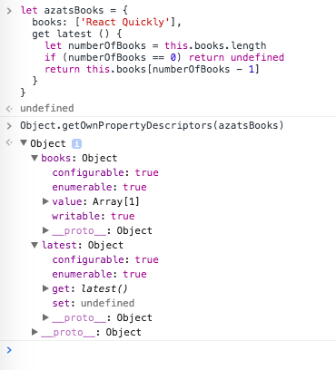

最近，我写了一篇[博客文章](https://webapplog.com/es6)，甚至还创建了一个关于 ES6 / ES2015 的[在线课程](https://node.university/p/es6)。你猜怎么着？TC39（强大的 JavaScript 监督者）正在向着 ES8 发展，因此让我们聊聊 ES7 和 ES8（或按官方正式叫法应该叫 ES2016 和 ES2017）。幸运的是，它们比 ES6 这个最佳标准的特性要少得多。这是真的！你看 ES7 只有两个新特性！

ES7 新增特性：

1. `Array.prototype.includes`
2. 求幂运算符`**`

截至本文撰写时（2017 年 1 月），ES8 标准尚未最终确定，但我们可以假设所有已完成的提案（第 4 阶段）和第 3 阶段的大部分（更多关于阶段的详细内容在[这里](https://tc39.github.io/process-document)和我的[课程](https://node.university/p/es6)中）。已完成的 2017 年（ES8）提案是：

1. `Object.values`/`Object.entries`
2. 字符串填充
3. `Object.getOwnPropertyDescriptors`
4. 函数的参数允许尾随逗号
5. 异步函数

在这篇文章中，我不会介绍第 3 阶段的提案，但是你可以在[这里](https://github.com/tc39/proposals/blob/master/README.md)查看第 1 到第 3 阶段的提案情况。

让我们深入了解提案及特性。

## `Array.prototype.includes`

使用`Array.prototype.includes`可以使一切变得容易简单。它是`indexOf`方法的替代者，过去开发人员使用`indexOf`方法检查数组中是否存在某个值。`indexOf`方法使用起来有点笨拙，因为它返回值所在数组的索引，或者在找不到该值的情况下返回`-1`，这么看来它返回一个数字值，而不是布尔值。开发人员还需要进行额外的判断。在 ES6 中，要检查值是否存在，你必须像下面显示的代码一样，因为当匹配不到时，`Array.prototype.indexOf`返回-1，-1 是真值（转化为布尔值是 true），但是当匹配的值的索引为 0 时，数组中确实包含该值，但是 0 转化为布尔值是`false`：

```js
let arr = ["react", "angular", "vue"];

// WRONG
if (arr.indexOf("react")) {
  // 0 -> evaluates to false, definitely as we expected
  console.log("Can use React"); // this line would never be executed
}

// Correct
if (arr.indexOf("react") !== -1) {
  console.log("Can use React");
}
```

或者使用一个小技巧，按位求反运算符`〜`会使代码更简洁紧凑，因为对任何数字的`〜`（按位求反）等于`-（a +1）`：

```js
let arr = ["react", "angular", "vue"];

// Correct
if (~arr.indexOf("react")) {
  console.log("Can use React");
}
```

使用 ES7 的`includes`方法的代码：

```js
let arr = ["react", "angular", "vue"];

// Correct
if (arr.includes("react")) {
  console.log("Can use React");
}
```

开发人员还可以在字符串中使用`includes`方法：

```js
let str = "React Quickly";

// Correct
if (str.toLowerCase().includes("react")) {
  // true
  console.log('Found "react"');
}
```

有趣的是，许多 JavaScript 库已经有了`includes`方法或类似的`contains`方法（[由于 MooTools 库的原因](https://esdiscuss.org/topic/having-a-non-enumerable-array-prototype-contains-may-not-be-web-compatible)，TC39 决定不使用 contains 这个名称）：

- jQuery 的：`$.inArray`
- Underscore.js：`_.contains`。
- Lodash：`_.includes`（在版本 3 和更低版本中，`_.contains`方法跟 Underscore 中的一样）
- CoffeeScript：`in`运算符（[示例](https://bit.ly/2jGxfaL)）
- Dart：`list.contains`（[示例](https://gist.github.com/anonymous/b8e39109e5705a9a0ff7281c1af97195)）

除了更加具有说服力和实际为开发人员提供布尔值（而不是匹配位置）之外，`include`方法还可以和`NaN`一起使用。最后，`include`方法具有第二个可选参数`fromIndex`，这有利于优化代码，因为它允许从指定的位置开始查找匹配项。

更多示例：

```js
console.log([1, 2, 3].includes(2)); // === true)
console.log([1, 2, 3].includes(4)); // === false)

console.log([1, 2, NaN].includes(NaN)); // === true)

console.log([1, 2, -0].includes(+0)); // === true)
console.log([1, 2, +0].includes(-0)); // === true)

console.log(["a", "b", "c"].includes("a")); // === true)
console.log(["a", "b", "c"].includes("a", 1)); // === false)
```

总而言之，`include`方法几乎为所有开发人员在需要检查值是否在数组/列表中时提供了便利……。让我们一起欢呼吧 ✌️！

## 求幂运算符`**`

这个运算符主要是为开发人员做一些数学运算，在 3D、虚拟现实、SVG 或数据可视化的情况下很有用。在 ES6 及之前的版本中，你必须创建一个循环，创建一个递归函数或使用 `Math.pow`。如果你忘了什么是指数，那就是当你把同一个数字（底数）乘以自身多次（指数）。例如，7 的 3 次幂是 `7 * 7 * 7`。

因此在 ES6 / ES2015 中，你可以使用`Math.pow`或创建一个小的递归箭头函数：

```javascript
calculateExponent = (base, exponent) =>
  base * (--exponent > 1 ? calculateExponent(base, exponent) : base);
console.log(calculateExponent(7, 12) === Math.pow(7, 12)); // true
console.log(calculateExponent(2, 7) === Math.pow(2, 7)); // true
```

现在在 ES7 / ES2016 中，面向数学的开发人员可以使用较短的语法：

```javascript
let a = 7 ** 12;
let b = 2 ** 7;
console.log(a === Math.pow(7, 12)); // true
console.log(b === Math.pow(2, 7)); // true
```

开发人员也可以使用操作赋值:

```javascript
let a = 7;
a **= 12;
let b = 2;
b **= 7;
console.log(a === Math.pow(7, 12)); // true
console.log(b === Math.pow(2, 7)); // true
```

ES 的很多新功能是从其他语言中借鉴过来的（CoffeeScript-最爱，Ruby 等）。如你所料其他语言中也会存在求幂运算符：

- Python: `x ** y`
- CoffeeScript: `x ** y`
- F#: `x ** y`
- Ruby: `x ** y`
- Perl: `x ** y`
- Lua, Basic, MATLAB: `x ^ y`

对我个人来说，在 JavaScript 中没有求幂运算符从来都不是问题。:)在我写了 15 年的 JavaScript 过程中，除了面试和像这样的教程外，我从未写过任何指数式的东西……求幂运算符对你来说是不可或缺的吗？

## `Object.values`/`Object.entries`

ECMAScript2017 规范中的`Object.values`和`Object.entries`，与`Object.keys`类似都返回一个数组，并且数组的顺序与 `Object.keys`返回的数组顺序一样。

`Object.keys`、`Object.values`和`Object.entries`返回数组中的每一项，都相应地包含了对象自身可枚举属性的键、值和键值对。

在 ES8/ES2017 之前，如果 JavaScript 开发人员需要迭代对象的自身属性，就必须使用`Object.keys`，然后对其返回的数组进行迭代，并使用`obj[key]`来访问每个值：

```js
let obj = { a: 1, b: 2, c: 3 };
Object.keys(obj).forEach((key, index) => {
  console.log(key, obj[key]);
});
```

或使用 ES6 / ES2015 的`for/of`会更好一些：

```js
let obj = { a: 1, b: 2, c: 3 };
for (let key of Object.keys(obj)) {
  console.log(key, obj[key]);
}
```

你也可以使用旧的`for/in`(ES5)，但这会遍历所有可枚举的属性(如原型中的属性或带名字的属性--详情见[MDN](https://developer.mozilla.org/en-US/docs/Web/JavaScript/Reference/Statements/for...of#Difference_between_for...of_and_for...in))，而不仅仅是自己的属性，这可能会意外地用`prototype`或`toString`之类的意外值破坏结果。

`Object.values`返回一个对象自身可枚举属性**值**的数组。我们可以使用`Array.prototype.forEach`对其进行迭代，但要使用 ES6 的箭头函数和隐式返回：

```js
let obj = { a: 1, b: 2, c: 3 };
Object.values(obj).forEach((value) => console.log(value)); // 1, 2, 3
```

或使用`for/of`：

```js
let obj = { a: 1, b: 2, c: 3 };
for (let value of Object.values(obj)) {
  console.log(value);
}
// 1, 2, 3
```

而 `Object.entries` 则会返回一个对象自身可枚举属性**键值对**（作为一个数组）的数组，返回结果数组中的每个一项也都是一个数组。

```js
let obj = {a: 1, b: 2, c: 3}
JSON.stringify(Object.entries(obj))
"[["a",1],["b",2],["c",3]]"
```

我们可以使用 ES6 / ES2015 的解构（请查看这篇[文章](https://webapplog.com/es6)或本[课程](https://node.university/p/es6)中关于深入 ES6 的内容），从一个嵌套数组中声明`key`和`value`：

```js
let obj = { a: 1, b: 2, c: 3 };
Object.entries(obj).forEach(([key, value]) => {
  console.log(`${key} is ${value}`);
});
// a is 1, b is 2, c is 3
```

如你所料，我们也可以使用 ES6 的 `for/of`（毕竟是用于数组的！）来迭代 `Object.entrents` 的结果：

```js
let obj = { a: 1, b: 2, c: 3 };
for (let [key, value] of Object.entries(obj)) {
  console.log(`${key} is ${value}`);
}
// a is 1, b is 2, c is 3
```

现在从对象中提取值和键值对变得更加容易了。`Object.values`和`Object.entries`的执行方式与`Object.keys`是相同的（自身属性+顺序相同）。与 `for/of`（ES6）一起使用，我们不仅可以提取还可以进行迭代。

## 使用`padStart`和`padEnd`对字符串填充

`String.prototype.padStart`和`String.prototype.padEnd`使得在 JavaScript 中处理字符串的体验更加愉悦，并有助于避免依赖外部的[库](http://www.haneycodes.net/npm-left-pad-have-we-forgotten-how-to-program)。

`padStart()`通过**在开头**插入填充字符返回指定长度（targetLength）的字符串。填充字符是一个指定的字符串，如果需要的话会重复使用，直到达到所需的长度。左侧是字符串的开头（至少在大多数西方语言中是这样的）。一个典型的示例使用空格填充：

```js
console.log("react".padStart(10).length); // "     react" is 10
console.log("backbone".padStart(10).length); // "  backbone" is 10
```

这对财务报表来可能是一种有用的方法:

```js
console.log("0.00".padStart(20));
console.log("10,000.00".padStart(20));
console.log("250,000.00".padStart(20));
```

结果会像会计分类账一样有很好的格式：

```
                0.00
           10,000.00
          250,000.00
```

让我们在第二个参数中传入一些非空的填充字符，使用一个字符来填充：

```js
console.log("react".padStart(10, "_")); // "_____react"
console.log("backbone".padStart(10, "*")); // "**backbone"
```

顾名思义`padEnd`将从右侧的结尾处填充字符串。至于第二个参数，你实际上可以使用任何长度的字符串。例如：

```js
console.log("react".padEnd(10, ":-)")); // "react:-):-" is 10
console.log("backbone".padEnd(10, "*")); // "backbone**" is 10
```

## `Object.getOwnPropertyDescriptors`

新的`Object.getOwnPropertyDescriptors`返回对象`obj`所有自身属性的描述符。它是[Object.getOwnPropertyDescriptor(obj，propName)](https://developer.mozilla.org/en-US/docs/Web/JavaScript/Reference/Global_Objects/Object/getOwnPropertyDescriptor)（只返回对象`obj`指定属性`propName`的描述符）的复数版本。

在我们这个不可变编程的时代，这个方法很有用（记住，对象在 JavaScript 中是引用传递的！）。在 ES5 中，开发人员使用`Object.assign()`复制对象。但是，`Object.assign()`不仅会复制或定义新的属性，还会分配属性。当使用更复杂的对象或类的原型时，这可能会导致问题。

`Object.getOwnPropertyDescriptors`允许创建对象的*真正的*浅层副本并创建子类。它是通过给开发人员提供描述符来实现的。把描述符放在`Object.create(prototype，object)`中，可以得到一个*真正的*浅层副本：

```js
Object.create(
  Object.getPrototypeOf(obj),
  Object.getOwnPropertyDescriptors(obj)
);
```

或者你可以像下面这样合并两个对象`target`和`source`：

```js
Object.defineProperties(target, Object.getOwnPropertyDescriptors(source));
```

这就是`Object.getOwnPropertyDescriptors`的用法，但是描述符是什么？就是一个描述对象。这不废话吗。

好吧，我们更深入了解一下描述符。在 JavaScript 中，有两种类型的描述符：

1. 数据描述符
2. 访问器描述符

访问器描述符有强制属性：`get`或`set`或同时具有`get`和`set`，就是你猜到的[getter](https://developer.mozilla.org/en-US/docs/Web/JavaScript/Reference/Functions/get)和[setter](https://developer.mozilla.org/en-US/docs/Web/JavaScript/Reference/Functions/get)函数。访问器描述符还有可选的属性：`configurable`和`enumerable`。

```js
let azatsBooks = {
  books: ["React Quickly"],
  get latest() {
    let numberOfBooks = this.books.length;
    if (numberOfBooks == 0) return undefined;
    return this.books[numberOfBooks - 1];
  },
};
```

由`Object.getOwnPropertyDescriptor(azatsBooks, 'books')`生成的`books`数据描述符的示例：

```
Object
	configurable: true
	enumerable: true
	value: Array[1]
	writable: true
	__proto__: Object
```

同样，`Object.getOwnPropertyDescriptor(azatsBooks, 'latest')`将显示`latest`的描述符。这是`latest`的（get）访问器描述符的示例：

```
Object
	configurable: truee
	numerable: true
	get: latest()
	set: undefined
	__proto__: Object
```

现在，让我们调用新方法来获取所有的描述符：

```js
console.log(Object.getOwnPropertyDescriptors(azatsBooks));
```

它将给出一个同时包含`books`和`latest`描述符的对象。

```
Object
  books: Object
    configurable: true
    enumerable: true
    value: Array[1]
    writable: true
    __proto__: Object
  latest: Object
    configurable: true
    enumerable: true
    get: latest()
    set: undefined
    __proto__: Object
  __proto__: Object
```

或者，如果你喜欢 DevTools 的格式，请看截图：



## 参数（包括形参和实参）列表尾随逗号

函数定义中的参数列表尾随逗号是纯粹的语法变化。在 ES5 中，正确的 JavaScript 函数定义语法，在最后一个函数参数后面*不应该有逗号*：

<!-- prettier-ignore -->
```js
var f = function(a,
  b,
  c,
  d) { // NO COMMA!
  // ...
  console.log(d)
}
f(1,2,3,'this')
```

在 ES8 中，可以使用尾随逗号：

<!-- prettier-ignore -->
```js
var f = function(a,
  b,
  c,
  d,
) { // COMMA? OK!
  // ...
  console.log(d)
}
f(1,2,3,'this')
```

现在，函数中的尾随逗号与数组（ES3）和对象字面量（ES5）中的尾随逗号规则是一致的：

<!-- prettier-ignore -->
```js
var arr = [1,  // Length == 3
  2,
  3,
]  // <--- ok
let obj = {a: 1,  // Only 3 properties
  b: 2,
  c: 3,
}  // <--- ok
```

更不用说它对 git 非常友好！

当使用多行样式（通常带有很多长参数名）时，最能凸显尾随逗号的作用。开发人员终于可以忘记看起来很奇怪的逗号优先的使用方式，在 ES5 及之前的版本中函数定义使用尾随逗号会发生错误，所以开发者不得不使用逗号优先的方式。现在，你可以在任何地方使用逗号，**甚至在最后一个参数后面**。

## 异步函数

异步函数(或 async/await)特性是基于[Promise](https://developer.mozilla.org/en-US/docs/Web/JavaScript/Reference/Global_Objects/Promise)的语法糖，所以你可能需要阅读一下 Promise，或者看一个视频课程来复习一下。异步函数是为了简化异步代码的编写，因为......好吧，因为人类的大脑不擅长并行无序的思考方式。它只是没有进化成那样。

就我个人而言，我从来不喜欢 Promises。与回调函数相比 Promise 非常啰嗦，所以我从来没有使用过 Promise。幸运的是，ES8 的异步函数更具有说服力。开发人员可以定义一个`async`函数，该函数可以包含也可以不包含对基于 promise 异步操作的`await`。在代码的背后，异步函数其实返回一个 Promise，然而你并不会在异步函数的函数体中看到关键字 Promise（当然，除非你明确使用它）。

例如，在 ES6 中，我们可以使用 Promise 和[Axios](https://github.com/mzabriskie/axios)库向 GraphQL 服务器发送请求：

```js
axios
  .get(`/q?query=${query}`)
  .then((response) => response.data)
  .then((data) => {
    this.props.processfetchedData(data); // Defined somewhere else
  })
  .catch((error) => console.log(error));
```

任何 Promise 库都能与新的异步函数兼容。我们可以使用同步代码 try/catch 来处理错误：

```js
async fetchData(url) => {
  try {
    const response = await axios.get(`/q?query=${query}`)
    const data = response.data
    this.props.processfetchedData(data)
  } catch (error) {
    console.log(error)
  }
}
```

异步函数返回一个 Promise，因此我们可以像这样继续执行流程：

```js
async fetchData(query) => {
  try {
    const response = await axios.get(`/q?query=${query}`)
    const data = response.data
  	return data
  } catch (error) {
    console.log(error)
  }
}
fetchData(query).then(data => {
  this.props.processfetchedData(data)
})
```

你可以在([Babel REPL](https://bit.ly/2kjLPFg))中看到下面这段代码。需要注意的是，这个示例是模拟实现 Axios 库的功能，在代码中调用了`setTimeout`模拟实现，并没有进行真正的 HTTP 请求：

```js
let axios = {
  // mocks
  get: function(x) {
    return new Promise((resolve) => {
      setTimeout(() => {
        resolve({ data: x });
      }, 2000);
    });
  },
};
let query = "mangos";
async function fetchData(query) {
  try {
    const response = await axios.get(`/q?query=${query}`);
    const data = response.data;
    return data;
  } catch (error) {
    console.log(error);
  }
}
fetchData(query).then((data) => {
  console.log(data); // Got data 2s later... Can use data!
});
```

使用 async/await，你的代码是异步执行的，但看起来像同步的。从上到下阅读这样的代码，更容易理解它在做什么，因为结果出现的顺序和函数体的执行顺序都是从上到下。

## 总结

这就是 ES8（未最终确定）和 ES7（已发布）的所有功能。如果你使用 Babel、Traceur 或类似的转译器，你现在就可以使用所有这些功能以及更多的 0-3 阶段的功能特性，而无需等待浏览器来实现它们。ES7 和 ES8 的代码将简单地转换为 ES5 兼容代码。甚至在 Internet Explorer 9 也可以使用。:)

一些需要注意的 ES8 功能特性，因为它们目前还处于第 3 阶段，但很可能最终会出现在 ES8/ES2017 中：

- 共享内存和原子
- SIMD.JS - SIMD APIs
- Function.prototype.toString
- 解除模板字符串的限制
- global
- Rest/Spread 属性
- 异步迭代
- import()

你可以在[有效提案](https://github.com/tc39/proposals/blob/master/README.md#active-proposals)和[已完成提案](https://github.com/tc39/proposals/blob/master/finished-proposals.md)中查看它们的状态。

- _本文章翻译自[ES7 and ES8 Features](https://node.university/blog/498412/es7-es8)。_
- _本人英文水平有限，翻译不正确不通顺的地方，敬请指出。_
