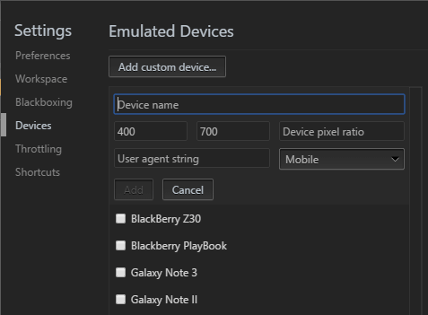

网站测试变得越来越复杂。仅仅在几个浏览器中检查功能的日子一去不复返了。你的最新杰作必须在一系列具有不同操作系统，屏幕分辨率和功能的移动、平板和桌面设备上进行严格评估。在极端情况下，它可能需要与原始开发一样长的时间。

该过程进一步被触摸屏、混合设备和高密度显示器复杂化。如果你使用鼠标和键盘在普通的PC上编码，将很难理解你的杰作如何操作。鼠标悬停等功能不一定会起作用，你的应用程序可能无法使用。但是，如何在开发过程中测试你的系统，避免在多个设备之间运行和切换的痛苦？

幸运的是，所有现代浏览器都提供移动设备仿真工具，并且Chrome中的移动设备仿真工具就是最好的工具之一。它可以在不离开舒服的PC开发环境下，帮助你识别早期的问题。

## 开发工具

启动Chrome，打开要测试的网页，然后打开**开发者工具**（菜单》更多工具》开发者工具，Mac快捷键是Cmd+Opt+I或F12，Windows和Linux快捷键是Ctrl+Shift+I）。

现在，你可以通过单击左上角的**切换设备工具栏**图标来启用浏览器仿真器：

现在将出现设备仿真：

当选择**响应（Responsive）**作为设备类型时，可以更改仿真屏幕的尺寸。

## 触摸启用仿真

将鼠标移到设备上可查看圆形“触摸”光标。这将对基于触摸的JavaScript事件（如`touchstart`，`touchmove`和`touchend`）做出反应。鼠标特定的事件和CSS效果不会做出反应。

按住**Shift**键，然后单击并移动鼠标以模拟双指缩放操作。

## 移动仿真器设备工具栏

值得花一点时间来让自己熟悉移动仿真器上方的工具栏和菜单：

默认设置有：

* 设备类型（或简称**响应（Responsive）**）
* 当前分辨率
* 缩放（屏幕可以放大或缩小以更好得适合仿真器面板）
* 竖屏/横屏切换按钮（假设选择了**响应（Responsive）**之外的设备）

三点菜单允许你显示或隐藏其他设置：

* 设备边框（如果可用，手机或平板电脑的外观图形）
* 媒体查询
* 像素标尺
* 设备像素比（例如2.0用于仿真的视网膜屏幕）
* 设备类型（类别如“mobile”或“tablet”）
* 网络限制（一种在较慢的连接上限制带宽和测试性能的方法）
* 捕获包括设备边框（如果显示）的屏幕截图。
* 最后一个选项允许你重置以上这些设置到默认状态。

## CSS媒体查询工具栏

工具栏下方的栏显示一系列典型的手机，平板电脑和设备尺寸。当选择**响应（Responsive）**作为设备的宽度设置时，可以单击此选项。

从三点菜单中选择**显示媒体查询（Show media queries）**，以查看在CSS中设置的所有媒体查询的图形颜色编码表示。

* 蓝色——以最大宽度的查询
* 绿色——以一个范围内宽度的查询
* 橘色——以最小宽度为目标的查询

可以单击任何颜色的条形栏以将仿真器屏幕设置为该宽度。

## 仿真设备选项

左侧的下拉菜单允许你选择设备。为流行的智能手机和平板电脑提供了几十个预设，包括iPhone，iPad，Kindles，Nexus平板电脑，三星Galaxy等。

并非所有设备都会同时显示在这里 - 选择设备下拉菜单中的**编辑（Edit）**...，或从开发者工具菜单（F1）中选择**设置（Settings）**，然后选择**设备（Devices）**标签：

你可以启用或禁用设备或通过以下定义输入你自己的设备：

* 名称
* 类型，比如“Mobile”或“Tablet”
* 浏览器user agent字符串
* 设备分辨率
* 像素比（例如iPhone Retina屏幕的像素比是2，其中像素密度是所报告的视口分辨率的两倍高）。

请注意，所有浏览器都使用HTTP headers中的用户代理（UA）字符串来标识自己。这可以在客户端或服务器端上检查，并且在web开发的黑暗日子期间（各个浏览器相互之间不兼容），将用于修改或提供不同的用户体验。在极端情况下，浏览用户将被引导到不同的站点。[该技术总是有缺陷的](https://www.sitepoint.com/why-browser-sniffing-stinks/)，但由于响应的网页设计技术和完全不可持续的市场上提供的设备数量已经变得很大程度上冗余。

## 带宽限制模拟

限制（Throttling）下拉菜单允许你模拟移动连接或不可靠的酒店和机场WiFi经常遇到的慢网络速度！你可以使用它来确保你的网站或应用程序快速加载，并在所有环境中保持响应。

**网络（Network）**标签和Chrome的设备工具栏（启用时）可以使用限制下拉菜单。你可以通过选择限制下拉菜单底部的**编辑（Edit...）**或从开发者工具菜单（F1）中选择**设置（Settings）**并选择**限制（Throttling）**选项卡来设置自己的带宽配置：

单击**添加自定义配置文件（Add custom profile）**，然后输入：

* 配置文件名称
* 下载速度（千比特每秒）
* 上传速度（千比特每秒）
* 以毫秒为单位的延迟（在进行网络请求时的典型延迟）

## 仿真移动传感器

智能手机和平板电脑通常具有传感器，例如在台式设备中不存在的GPS，陀螺仪和加速度计。这些可以在Chrome中通过选择**更多工具（More tools）**，然后从开发工具主三点菜单中选择**传感器（Sensors）**：

将出现一个新面板，你可以定义：

* 当前的纬度和经度，或从下拉列表中选择一个主要城市。你也可以选择禁用位置，用来模拟当设备无法获取GPS信号时应用程序的反应。
* 方向。有几个可用的预设方向，或者可以通过单击和拖动来移动设备图像来改变方向。

## 远程真实设备调试

最后，Chrome允许你通过USB连接真实的Android设备进行远程设备调试。从开发者工具主三点菜单中选择**更多工具（More tools）**，然后选择**远程设备（Remote devices）**。确保勾选**Discover USB debices**，然后连接手机或平板电脑，并按照说明进行操作。

Chrome允许你设置端口转发，以便导航到设备上本地服务器上的网址。 Chrome的预览面板显示设备屏幕的同步视图，你可以使用设备或Chrome本身进行交互。

全方位的开发者工具包括**应用程序（Application）**选项卡，可用于在离线模式下测试Progressive Web Apps。请注意，不同于需要HTTPS的真实应用程序，Chrome允许PWA通过HTTP连接从本地主机运行。

## 太棒了!我现在不需要任何设备!

Chrome的移动浏览器模拟器非常实用和强大，但它不能替代在真实设备上与你的网站或应用互动，以评估完整的用户体验。

你也应该知道，没有设备模拟器是完美的。例如，Chrome在iPhone或iPad上显示网页的表示，但不会尝试模拟Safari的标准支持或怪异模式（quirks）。

尽管如此，对于快速和讨厌的移动测试，Chrome的设备模拟器是优秀的。它比在真正的智能手机和平板电脑设备之间切换容易得多，你将拥有所有的开发工具。这将节省工作量。

* *本文章翻译自[How to Use Mobile Emulation Mode in Chrome](https://www.sitepoint.com/use-mobile-emulation-mode-chrome/)。*
* *本人英文水平有限，翻译不正确不通顺的地方，敬请指出。*
